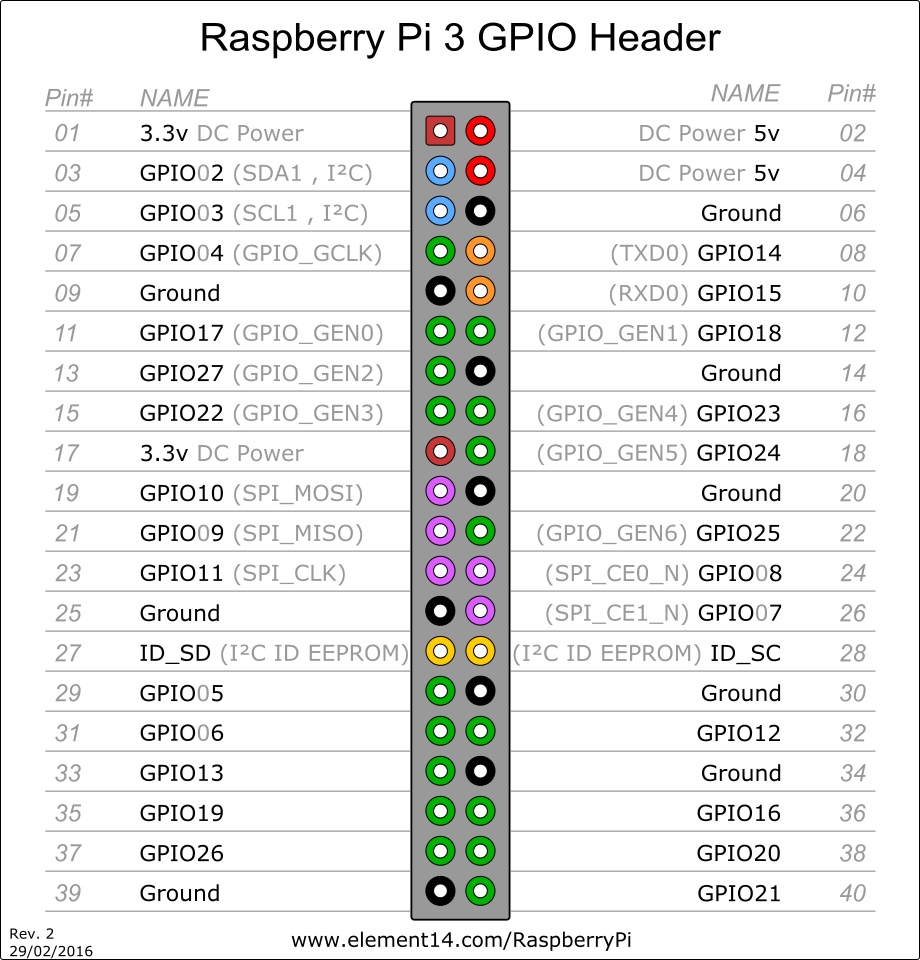

# Smart-home
Smart Home | Web Of Things | Artevelde University College Ghent

# Authors
[Brent De Roeck](https://github.com/brendero)

[Pieter Vleminck](https://github.com/PietVlem)


## Needed Parts
- Raspberry Pi 3 
- Raspberry Pi Camera
- Breadboard
- Led Lights
- Button
- T-cobbler

## Ionic application

### Installing ionic
* `npm install -g cordova ionic`
* starting app: `ionic serve`

#### Firebase
- Create a firebase database on the [Google Firebase website](https://firebase.google.com)
- Change to rules to:
```
{
  "rules": {
    ".read": "true",
    ".write": "true"
  }
}
```

###### Ps: Be awere that this is not secure at all || Also : Don't forget to link your firebase in your ionic app.
## Raspberry installations
### ALWAYS UPDATE YOUR SYSTEM FIRST
```
 sudo apt-get update
 sudo apt-get upgrade
```

### Installing firebase
```
 sudo pip3 install python-firebase
 sudo pip3 install firebase-admin
```
!! Your time has to be set right otherwise it won't work !! \s\s
Without internet:
```
sudo date -s "Sat Sept 23 19:21:11 UTC 2017"
sudo dpkg-reconfigure tzdata
```
With internet:
```
sudo sntp -s time.google.com
```

### Installing Google cloud:
```
sudo pip3 install google-cloud
sudo apt-get install google-cloud-sdk
gcloud auth application-default login
```

### Pygame (music)
```
sudo apt-get install pip
sudo pip install pygame
```
Documentation: [pygame mixer music - https://www.pygame.org/docs/ref/music.html](https://www.pygame.org/docs/ref/music.html)

### To start the python project
```
sudo python3 SmartHome.py
```

#### Additional info
if gloud gives an error on startup try: 
```
export GCLOUD_PROJECT=my-project-1234
```
change my-project-1234 with your firebase project-id

GPIO scheme:



